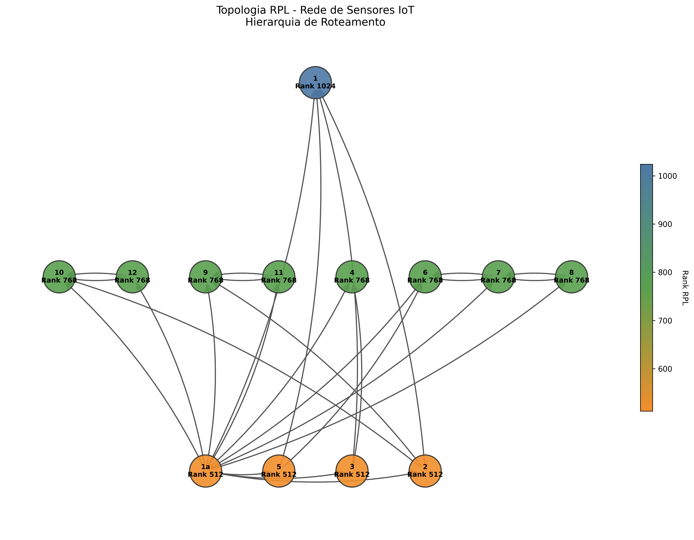

# 📡Análise de Topologia RPL- Redes de Sensores Iot

### Este projeto oferece ferramentas para análise e visualização de topologias de redes RPL (Routing Protocol for Low-Power and Lossy Networks) através da captura e processamento de pacotes de rede.

## 🎯 Sobre o Projeto

### O RPL (RFC 6550) é um protocolo de roteamento hierárquico projetado especificamente para redes de sensores sem fio de baixo consumo energético e enlaces com perdas (LLNs - Low-Power and Lossy Networks). Este projeto fornece:

- Análise automatizada de arquivos de captura de rede (.pcap/.pcapng)
- Visualização gráfica da topologia RPL com hierarquia de ranks
- Relatórios detalhados da estrutura da rede
- Identificação automática do DODAG Root e nós intermediários

## 🔧 Funcionalidades

### 📊 Análise de Pacotes PCAP

- Extração automática de pacotes ICMPv6 RPL
- Identificação de padrões de tráfego entre nós
- Detecção da hierarquia de ranks
- Geração de relatórios estruturados

### 🎨 Visualização da Topologia

- Grafo hierárquico com cores baseadas em ranks
- Layout organizado por níveis de hierarquia
- Barra de cores indicativa dos ranks RPL
- Exportação em alta resolução (PNG 300 DPI)

## 🛠️ Requisitos do Sistema

### Dependências Python

```bash
# bash
pip install scapy networkx matplotlib
```

## Tecnologias e Bibliotecas Utilizadas

### 🖥️ Linguagem de Programação:

- python 3.12.4

### Bibliotecas Necessárias:

- Scapy: Manipulação e análise de pacotes de rede
- NetworkX: Criação e análise de grafos
- Matplotlib: Visualização eS geração de gráficos
- Collections: Estruturas de dados (incluído no Python)
- OS: Manipulação de arquivos e diretórios (incluído no Python)

## Como Usar

### 1. Análise de Arquivos PCAP

```bash
# Executar análise automática
python rpl_analyzer.py
```

### O que faz:

- Processa todos os arquivos .pcap/.pcapng em uma pasta específica
- Extrai pacotes RPL (ICMPv6)
- Identifica padrões de comunicação
- Gera topologia baseada no tráfego observado
- Cria relatório detalhado

### Configuração:

```python
# Alterar o caminho da pasta no código
pcap_dir = r"C:\caminho\para\seus\arquivos\pcap"
```

### 2. Geração do Grafo Detalhado

```bash
# Executar geração do grafo
python rpl_graph_generator.py
```

### O que faz:

- Cria visualização hierárquica da topologia RPL
- Aplica cores baseadas nos ranks dos nós
- Gera layout organizado por níveis
- Salva imagem em alta resolução

## Visualização da Topologia



## 📋 Interpretação dos Resultados

### 🎨 Hierarquia de Cores no Grafo

| 🔑 Cor         | 🏅 Rank | 📡 Função na Rede                  |
| -------------- | ------- | ---------------------------------- |
| 🟠 **Laranja** | 512     | DODAG Root e nós do mesmo nível    |
| 🟢 **Verde**   | 768     | Nós intermediários                 |
| 🔵 **Azul**    | 1024    | Nós folha (mais distantes do root) |

## Estrutura da Topologia RPL

- DODAG Root (1a): Nó raiz com menor rank (512)
- Nós Intermediários (2, 3, 5): Mesmo nível do root (rank 512)
- Nós de Nível Médio (4, 6, 7, 8, 9, 10, 11, 12): Rank intermediário (768)
- Nó Folha (1): Maior rank (1024), mais distante do root

### Fluxo de Dados

### As setas direcionais no grafo representam:

- Caminhos de comunicação estabelecidos
- Hierarquia de roteamento RPL
- Relações pai-filho na topologia

## 📊 Exemplo de Relatório Gerado

=== Relatório de Topologia RPL ===

- Total pacotes: 738
- Pacotes RPL: 357
- Nós detectados: 13

Hierarquia de nós:

- Nó 1a (Rank: 512) - DODAG Root
- Nó 2 (Rank: 512)
- Nó 3 (Rank: 512)
- Nó 5 (Rank: 512)
- Nó 4 (Rank: 768)
- Nó 6 (Rank: 768)
- ...
- Nó 1 (Rank: 1024) - Nó Folha

Relações de roteamento:

- 1a -> 1
- 1a -> 5
- 1a -> 2
  ...

## 🔍 Protocolo RPL - Conceitos Fundamentais

### DODAG (Destination Oriented Directed Acyclic Graph)

- Estrutura hierárquica em forma de árvore
- Root único que atua como ponto de coleta
- Ranks crescentes conforme distância do root

### Tipos de Mensagens RPL

- DIO (DODAG Information Object): Propagação de informações do pai para filhos
- DAO (Destination Advertisement Object): Informações de roteamento dos filhos para pais
- DIS (DODAG Information Solicitation): Solicitação de informações de roteamento

### Métricas de Roteamento

- Rank: Distância relativa do nó até o root
- ETX (Expected Transmission Count): Número esperado de transmissões
- Energia: Consumo energético do caminho

## 🛠️ Personalização

### Modificar Cores do Grafo

```python
# No arquivo rpl_graph_generator.py
cmap = LinearSegmentedColormap.from_list('rank', ['#cor1', '#cor2', '#cor3'])
```

### Ajustar Layout

```python
# Modificar posicionamento dos nós
rank_levels = {512: 0, 768: 1, 1024: 2}  # y_position por rank
```

### Configurar Tamanho da Imagem

```python
fig, ax = plt.subplots(figsize=(largura, altura))
```

## 🔧 Troubleshooting

### Problemas Comuns

#### Erro: "No module named 'scapy'"

```bash
# bash
pip install scapy
```

#### Erro: "Unable to determine Axes for Colorbar"

- Verifique se está usando:

```python
fig, ax = plt.subplots() em vez de plt.figure()
```

#### Nenhum pacote RPL encontrado

- Verificar se os arquivos .pcap contêm tráfego ICMPv6
- Confirmar se o caminho dos arquivos está correto

#### Grafo não exibe corretamente

- Verificar se os dados de nodes_data e edges_data estão corretos
- Confirmar se todos os nós referenciados nas arestas existem
